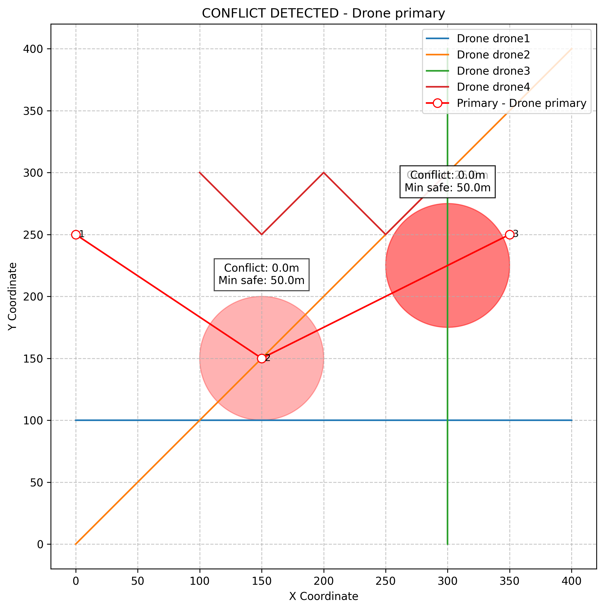
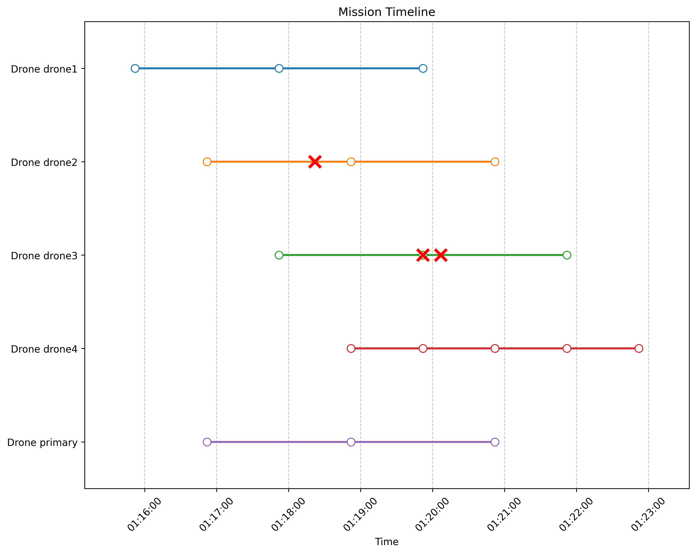

# UAV Strategic Deconfliction System

<p align="center">
  
</p>

## Project Overview
This system verifies drone flight safety in shared airspace by detecting potential conflicts in both space and time against other drone flight paths. As the drone industry expands with applications in delivery, surveillance, and urban mobility, automated solutions for airspace management become essential.

## Key Features
- **Spatial-Temporal Conflict Detection**: Analyzes drone flight paths to identify potential collisions in 3D space with precise timing information
- **Minimum Distance Calculation**: Implements vector mathematics to calculate the minimum distance between flight path segments
- **Comprehensive Visualization**: Provides spatial plots, timeline views, and animations for clear conflict representation
- **Altitude-Based Separation**: Supports true 3D airspace utilization with altitude-based deconfliction
- **Multiple Demonstration Scenarios**: Includes various test cases to validate system functionality

## Technologies Used
- Python 3.x with object-oriented design
- NumPy for vector mathematics and spatial calculations
- Matplotlib for data visualization and animation
- SciPy for optimization algorithms
- Pandas for data manipulation
- Plotly for interactive visualizations

## Demo Scenarios
The system includes three demonstration scenarios:

1. **Scenario 1**: A mission that appears safe at first glance but contains a subtle conflict
2. **Scenario 2**: A complex mission with multiple conflicts across different times and locations
3. **Scenario 3**: Demonstration of altitude-based separation for 3D conflict resolution

<p align="center">
  
</p>

## Installation and Usage
```bash
# Clone the repository
git clone https://github.com/yourusername/uav-deconfliction.git
cd uav-deconfliction

# Create a virtual environment (recommended)
python -m venv venv
source venv/bin/activate  # On Windows: venv\Scripts\activate

# Install dependencies
pip install -r requirements.txt

# Run all demonstration scenarios
python main.py --run-all

# Run a specific scenario with animation
python main.py --scenario 2 --animate
```

## Project Structure
- `deconfliction/` - Core system modules
  - `core.py` - Main deconfliction algorithms
  - `models.py` - Data models for missions and flights
  - `visualization.py` - Plotting and animation tools
- `examples/` - Example scenarios and demo code
- `tests/` - Test suite for system verification
- `output/` - Generated visualizations and results

## Technical Highlights
- Efficient two-phase conflict detection (temporal filtering followed by spatial analysis)
- Vector-based minimum distance calculation between 3D line segments
- Time interpolation for precise conflict reporting
- Dynamic visualization with temporal animation

## Future Development
- Machine learning integration for predictive conflict resolution
- Real-time updates for dynamic flight plan changes
- Optimization algorithms for automatic path planning
- Integration with existing drone management platforms

## License
MIT 